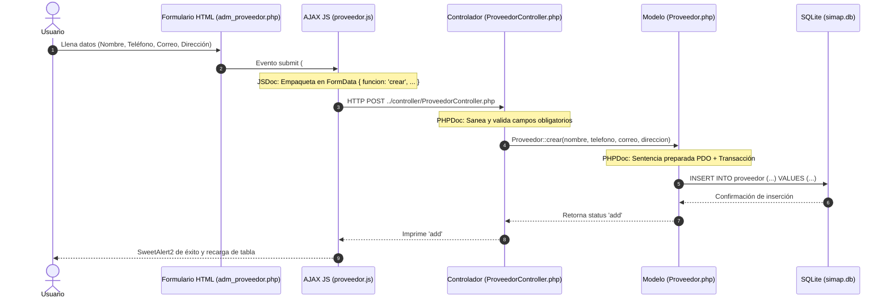

# Ejemplo de Referencia: Flujo Extremo a Extremo Documentado

Este documento ilustra cómo se documenta un módulo completo desde la vista hasta la base de datos siguiendo la skill `code-docs`.

```mermaid
sequenceDiagram
    autonumber
    actor U as Usuario
    participant V as Formulario HTML (adm_proveedor.php)
    participant J as AJAX JS (proveedor.js)
    participant C as Controlador (ProveedorController.php)
    participant M as Modelo (Proveedor.php)
    participant D as SQLite (simap.db)

    U->>V: Llena datos (Nombre, Teléfono, Correo, Dirección)
    V->>J: Evento submit (#form-crear)
    Note over J: JSDoc: Empaqueta en FormData { funcion: 'crear', ... }
    J->>C: HTTP POST ../controller/ProveedorController.php
    Note over C: PHPDoc: Sanea y valida campos obligatorios
    C->>M: Proveedor::crear(nombre, telefono, correo, direccion)
    Note over M: PHPDoc: Sentencia preparada PDO + Transacción
    M->>D: INSERT INTO proveedor (...) VALUES (...)
    D-->>M: Confirmación de inserción
    M-->>C: Retorna status 'add'
    C-->>J: Imprime 'add'
    J-->>U: SweetAlert2 de éxito y recarga de tabla
```
